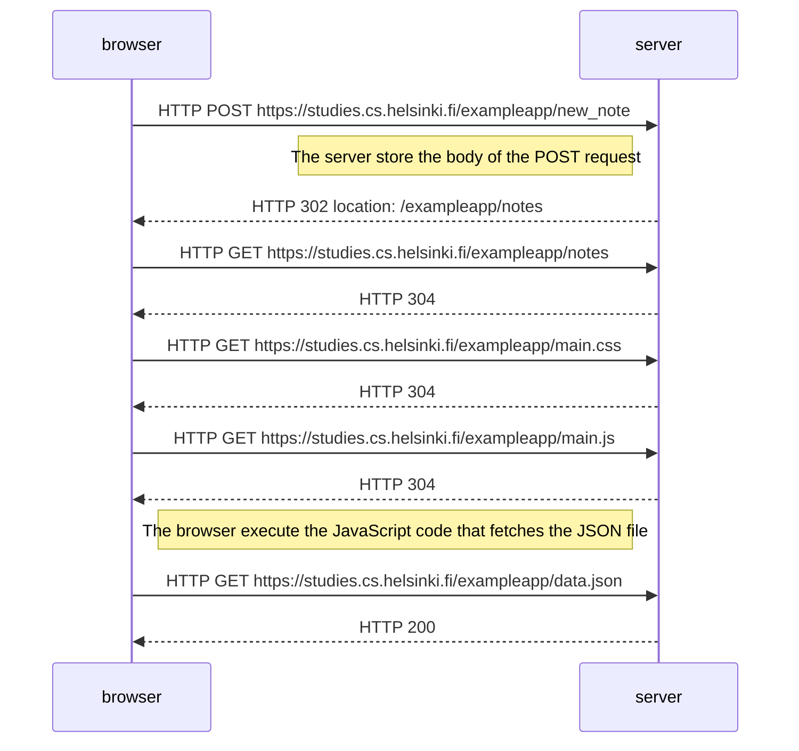

```mermaid
sequenceDiagram

participant browser
participant server

browser->>server: HTTP POST https://studies.cs.helsinki.fi/exampleapp/new_note
Note left of server: The server store the body of the POST request
server-->>browser: HTTP 302 location: /exampleapp/notes

browser->>server: HTTP GET https://studies.cs.helsinki.fi/exampleapp/notes
server-->>browser: HTTP 304

browser->>server: HTTP GET https://studies.cs.helsinki.fi/exampleapp/main.css
server-->>browser: HTTP 304

browser->>server: HTTP GET https://studies.cs.helsinki.fi/exampleapp/main.js
server-->>browser: HTTP 304

Note right of browser: The browser execute the JavaScript code that fetches the JSON file
browser->>server: HTTP GET https://studies.cs.helsinki.fi/exampleapp/data.json
server-->>browser: HTTP 200
```